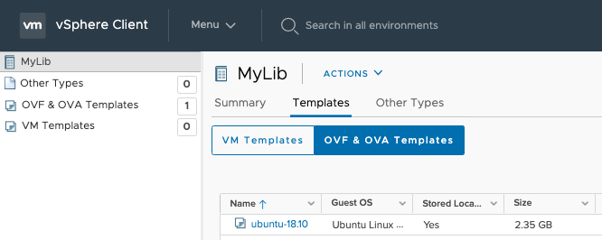

  [57308c0e]: GetStarted.md "Get Started Guide"

   1. Follow the [Getting Started Guide][57308c0e] to install the Helm Chart into your Kubernetes Cluster.

   2. Before you start to use the vmoperator, you should import an OVA or OVF image into the Content Library of vCenter Server, shown as following:

   

   3. Create a ContentLibrary resource for it (The "libraryName" value should be the same in your content library. It is "MyLib" in my case.)

  ```yaml
  $ cat contentlibrary_test.yaml

  apiVersion: vmoperator.wangyu.cpbu.vmware/v1beta1
  kind: ContentLibrary
  metadata:
    name: contentlibrary-test
  spec:
    libraryName: MyLib

  $ kubectl create -f contentlibrary_test.yaml
  ContentLibrary.vmoperator.wangyu.cpbu.vmware/contentlibrary-test created.
  ```

   4. To make sure the corresponding "VirtualMachineImage" resources is created.

  ```
  $ kubectl get vmimage
  NAME           VERSION   OSTYPE
  ubuntu-18.10
  ```


   5. Create the VirtualMachineClass Resource:

  ```yaml
  $ more small-vm.yaml

  apiVersion: vmoperator.wangyu.cpbu.vmware/v1beta1
  kind: VirtualMachineClass
  metadata:
    name: best-effort-small
  spec:
    hardware:
      cpus: 2
      memory: 4Gi

  $ kubectl create -f small-vm.yaml
  VirtualMachineClass.vmoperator.wangyu.cpbu.vmware/best-effort-small created.

  ```


   6. Create the ResourcePolicy resource:

  ```yaml
  $ more resourcepolicy.yaml

  apiVersion: vmoperator.wangyu.cpbu.vmware/v1beta1
  kind: VirtualMachineSetResourcePolicy
  metadata:
    name: virtualmachinesetresourcepolicy-sample
  spec:
    # Add fields here
    resourcepool:
      name: wangyupool
      reservations:
        cpu: 1000m
        memory: 1000M
      limits:
        cpu: 2000m
        memory: 2000M
    folder:
      name: wangyufolder

  $ kubectl create -f resourcepolicy.yaml
  VirtualMachineSetResourcePolicy.vmoperator.wangyu.cpbu.vmware/virtualmachinesetresourcepolicy-sample created.

  ```


   7. Create the VirtualMachine resource. (please note, in this yaml file, "className","imageName","resourcePolicyName" should be consistent with the objects created in previous steps. The "storageClass" should be one of your datastore names)

  ```yaml
  $ more vm.yaml

  apiVersion: vmoperator.wangyu.cpbu.vmware/v1beta1
  kind: VirtualMachine
  metadata:
    name: ubuntu18
  spec:
    className: best-effort-small
    imageName: ubuntu-18.10
    networkInterfaces:
      - networkName: VM Network
        networkType: standard-portgroup
    powerState: poweredOn
    readinessProbe:
      tcpSocket:
        port: 6443
    resourcePolicyName: virtualmachinesetresourcepolicy-sample
    storageClass: vsanDatastore
    vmMetadata:
      configMapName: ubuntu-cloud-init
      transport: ExtraConfig

  ```

  ```
  $ kubectl create -f vm.yaml
  VirtualMachine.vmoperator.wangyu.cpbu.vmware/ubuntu18 created.

  $ kubectl get vm -w
  ```
